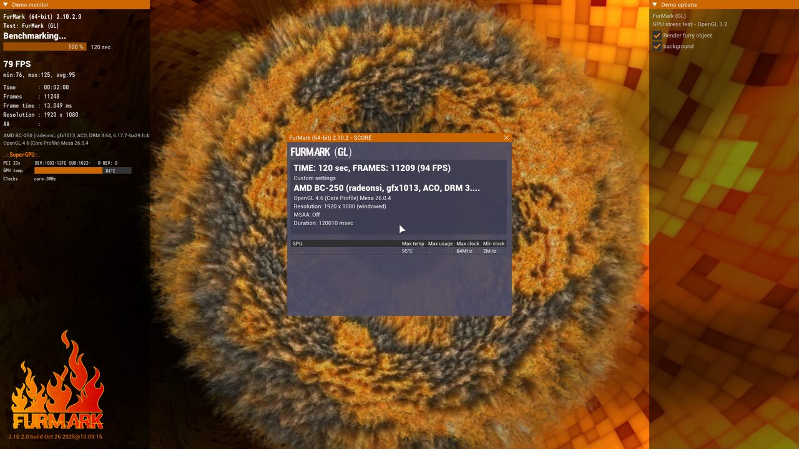

# BC-250 AutoTune

An MCP server exposing AMD BC-250 telemetry and tuning controls, plus an
optimizer that uses them to tune a unit automatically — with a boot watchdog
that reverts an unproven configuration if the machine hangs.

> **Every BC-250 is different, and tuning one is your responsibility.** Read
> [docs/SAFETY.md](docs/SAFETY.md) before pointing this at hardware you care
> about. It matters more for an automated tuner than for a manual GUI, not
> less.

## What it does

- **Reads** GPU/CPU temperature, power, clocks, voltage, fan RPM, and SMU
  throttle status — no root, no SMU mailbox contention.
- **Applies** GPU frequency changes through a safety envelope that refuses
  out-of-range values rather than clamping them, one small step per call.
- **Snapshots** the verbatim bytes of every config file before each write, and
  rolls back on demand.
- **Reverts automatically** on the next boot if a config was applied and never
  proven stable — the piece that makes unattended tuning survivable.
- **Benchmarks** with FurMark, sampling telemetry throughout and aborting on an
  over-temperature.
- **Controls fans** where the hardware allows it — the in-tree `nct6683` driver
  exposes PWM read-only, so this needs the out-of-tree
  [`nct6687d`](https://github.com/Fred78290/nct6687d) module. `get_fan_state()`
  reports whether your board can do it.

## Supported governors

A BC-250 runs exactly one GPU governor; both in the wild are supported, and the
backend is detected automatically.

| | `oberon-governor` | `cyan-skillfish-governor-smu` |
|---|---|---|
| Operating points | exactly two | full V/F curve |
| Control | config file + restart | **live D-Bus** |
| Survives reboot | yes | no (config file does) |

The D-Bus path is preferred where available: changes are volatile, so a power
cycle is a guaranteed rollback.

## Benchmarks

Two 120 s FurMark passes at 1920x1080 on the reference unit, each started from
a cooled GPU (60 °C gate) so the pair is comparable.

**Stock** is oberon's packaged default, `1000–2000 MHz @ 1000 mV`. **Tuned** is
a *lower* clock ceiling at a *lower* voltage, `1000–1600 MHz @ 875 mV` — an
undervolt, not an overclock.

The counter-intuitive result is that the undervolt wins on every metric at
once: faster, cooler, and less power. On a board this thermally constrained
1000 mV generates more heat than the cooler can shed, so the SMU throttles hard
and the *sustained* clock settles below what the cooler 875 mV config holds
comfortably. Stock also peaked at 96.5 °C, within 0.5 °C of the harness abort
threshold.

**Less voltage bought more performance here. Raising limits did not** — a
separate test stepping the ceiling 1600 → 1650 MHz produced no gain at all.

<!-- BENCHMARKS:START -->

| Metric | Stock | Tuned | Change |
|---|---:|---:|---|
| GPU range | 1000–2000 MHz | 1000–1600 MHz | |
| GPU voltage | 1000 mV | 875 mV | |
| Started at | 60.0 °C | 59.2 °C | |
| Score (frames) | 9362 | 11209 | ▲ +1847.0 (+19.7%) ✓ |
| Avg FPS | 78.0 | 95.0 | ▲ +17.0 (+21.8%) ✓ |
| Min FPS | 76.0 | 76.0 | — +0.0 (+0.0%) |
| Avg GPU temp | 91.8 °C | 87.1 °C | ▼ -4.6 °C (-5.0%) ✓ |
| Max GPU temp | 96.5 °C | 94.8 °C | ▼ -1.8 °C (-1.8%) ✓ |
| Avg power | 122.8 W | 111.4 W | ▼ -11.4 W (-9.3%) ✓ |

Efficiency: **0.635 → 0.853 FPS/W** (+34.3%).

| Stock | Tuned |
|---|---|
|  |  |

<details>
<summary>All completed runs</summary>

| Run | Config | GPU range | Start | Frames | Avg FPS | Max temp | Avg power |
|---|---|---|---:|---:|---:|---:|---:|
| 2026-09-10T00:40:22-0700 | oc-1600 | 1000–1600 MHz | 56.0 °C | 12199 | 102.0 | 95.0 °C | 117.6 W |
| 2026-09-10T00:44:50-0700 | oc-1650 | 1000–1650 MHz | 55.8 °C | 11979 | 101.0 | 94.8 °C | 116.4 W |
| 2026-09-10T00:48:49-0700 | oc-1600 | 1000–1600 MHz | 55.8 °C | 12261 | 103.0 | 94.8 °C | 117.9 W |
| 2026-09-10T14:40:48-0700 | stock-2000-1000mv | 1000–2000 MHz | 57.2 °C | 9385 | 78.0 | 96.8 °C | 122.6 W |
| 2026-09-10T14:43:33-0700 | oc-1600-875mv | 1000–1600 MHz | 62.2 °C | 10843 | 92.0 | 94.8 °C | 109.2 W |
| 2026-09-10T14:46:33-0700 | stock-final | 1000–2000 MHz | 60.0 °C | 9362 | 78.0 | 96.5 °C | 122.8 W |
| 2026-09-10T14:49:25-0700 | tuned-final | 1000–1600 MHz | 59.2 °C | 11209 | 95.0 | 94.8 °C | 111.4 W |

</details>

> **3 run(s) aborted on a thermal limit** and are excluded from the table above, since an aborted run produces no score. Most recent: GPU reached 92.25 C, at or above the 92.0 C abort threshold

> **What "stock" means here.** Only the *GPU governor configuration* is stock. Both runs were taken on a machine with the **40 CU unlock and the 8c/16t CPU core unlock already active** — 40 of 40 compute units (20 WGPs) applied by a BC-250-patched kernel via `amdgpu.bc250_cc_write_mode=3`, and 16 threads online against the factory 6c/12t.

> A stock-topology BC-250 (24 CU, 6c/12t) will score lower on **both** sides. These numbers isolate the effect of the governor configuration with the unlocks held constant; the unlocks themselves are a separate and almost certainly larger lever.

<sub>Generated by `benchmarks/scripts/generate_readme_benchmarks.py`. FurMark runs start from a cooled GPU (60 °C gate) so results are comparable; every row records the temperature it actually started at.</sub>

<!-- BENCHMARKS:END -->

## Requirements

- A real BC-250, running Linux, driven locally or over SSH.
- **Passwordless sudo.** Almost everything needs root: SMU access through PCI
  config space, `umr` register reads, and systemd. Unattended tuning cannot work
  if sudo prompts.
- Python 3.11+.
- One of the two GPU governors installed and running —
  [`oberon-governor`](https://gitlab.com/mothenjoyer69/oberon-governor) or
  [`cyan-skillfish-governor-smu`](https://github.com/filippor/cyan-skillfish-governor).
  The backend is detected automatically; you do not configure which.
- Optional, for benchmarking: [FurMark 2](https://geeks3d.com/furmark/) (Linux
  x86_64), plus `ffmpeg` for screenshots and `xrdb` — without `xrdb` FurMark
  segfaults on a fresh display, see [docs/TARGET_MACHINE.md](docs/TARGET_MACHINE.md).

## Install

```bash
git clone https://github.com/bandlayash/bc250-autotune.git
cd bc250-autotune
python3 -m venv .venv
.venv/bin/pip install -e ./mcp_server
```

On an immutable distro (Bazzite, Silverblue) a venv is the right move — nothing
needs to go into `/usr`.

Check what the server can see on your box before doing anything else:

```bash
.venv/bin/python -c "import json, bc250_mcp.server as s; print(json.dumps(s.get_server_status(), indent=2))"
```

That reports the detected governor, which sensors work, and which upstream
tools are missing, so you can plan around gaps rather than hit them mid-tune.

## Connect it to an MCP client

The server speaks stdio. For Claude Code:

```bash
claude mcp add bc250 -- /absolute/path/to/bc250-autotune/.venv/bin/bc250-mcp
```

For any client that takes a JSON config:

```json
{
  "mcpServers": {
    "bc250": {
      "command": "/absolute/path/to/bc250-autotune/.venv/bin/bc250-mcp"
    }
  }
}
```

The editable install puts a `bc250-mcp` console script in the venv, so no
working directory or `PYTHONPATH` is needed. Verified: 18 tools over stdio.

Set `DRY_RUN=1` in the environment to exercise the whole loop — envelope
checks, step limits, snapshots — without touching hardware. Refusals are still
refusals in dry run, so the rehearsal does not lie to you.

## Optional: fan control

Fan control needs the out-of-tree
[`nct6687d`](https://github.com/Fred78290/nct6687d) module — the in-tree
`nct6683` driver exposes PWM read-only. On an immutable distro this is fiddly
(read-only `/usr`, possibly no matching `kernel-devel`, and SELinux blocking
both the module and its loader), so it is scripted:

```bash
sudo true            # the script uses sudo throughout
fan/install-nct6687.sh
```

It builds against the running kernel, verifies the vermagic matches, installs a
systemd unit, and confirms PWM became writable. **Re-run it after any kernel
change** — vermagic is pinned to one release and the module will silently
refuse to load against another.

Check the result with `get_fan_state()`; `controllable` tells you whether it
worked. Note that fan control is not guaranteed to buy performance: on the
reference unit the chip's automatic curve already runs the fan at 100%, so
there was nothing to gain.

## Install the watchdog (do this before any unattended tuning)

This is what reverts a configuration that hangs the machine. It runs as a
**separate process** from the MCP server, because in-memory state is exactly
what a hang destroys.

```bash
sudo install -d -m 0755 /opt/bc250-autotune
sudo cp -r mcp_server watchdog /opt/bc250-autotune/
sudo cp watchdog/bc250-watchdog.service watchdog/bc250-watchdog-monitor.service /etc/systemd/system/
sudo systemctl daemon-reload
sudo systemctl enable --now bc250-watchdog.service

# Snapshots must live where the watchdog can read them as root at boot.
sudo install -d -o "$USER" -g "$USER" -m 0755 /var/lib/bc250-autotune
```

Verify it is actually armed:

```bash
.venv/bin/python -c "import json, bc250_mcp.server as s; print(json.dumps(s.get_watchdog_status(), indent=2))"
```

`unattended_revert_ready` must be `true`. If it is not, the `problems` list says
why. Do not start an unattended run until it is.

## Tuning

Take a snapshot first, then let the agent work through the
[optimizer skill](skill/bc250-optimizer/SKILL.md):

```
snapshot_config("stock")     # capture what you have now
get_safety_envelope()        # the bounds it must stay inside
run_benchmark("stock", 120)  # baseline -- run it TWICE, see below
set_gpu_range(1000, 1650)    # one 50 MHz step; refuses larger jumps
run_benchmark("tuned", 120)
rollback("last_good")        # if anything looks wrong
mark_stable()                # once a config has proven itself
```

**Establish a noise floor before believing any result.** Run the baseline twice
without changing anything and compare. On the reference unit the same config
scored 12261 and 10843 depending only on starting temperature — a change
smaller than that spread is not a result.

To apply a configuration you have already decided on, including voltage, use
`set_gpu_config(min_mhz, max_mhz, min_mv, max_mv)` instead. It is absolute
rather than stepped; the step limit exists to constrain an autonomous search,
not you.

## Standalone benchmarking

No MCP client needed:

```bash
export BC250_FURMARK_DIR=~/furmark/FurMark_linux64   # if not in a default path
benchmarks/scripts/run_benchmark.sh stock 120
python benchmarks/scripts/generate_readme_benchmarks.py
```

Each run waits for the GPU to cool to 60 °C first, samples telemetry every
second, aborts on an over-temperature, appends a row to
`benchmarks/results.jsonl`, and captures the score box.

## Configuration

| Variable | Purpose |
|---|---|
| `DRY_RUN=1` | log intended writes, touch no hardware |
| `BC250_SAFETY_ENVELOPE` | path to an alternative `safety_envelope.yaml` |
| `BC250_STATE_ROOT` | where snapshots and the watchdog marker live |
| `BC250_FURMARK_DIR` | directory containing the `furmark` binary |
| `BC250_BENCH_ROOT` | where `results.jsonl` and `raw/` are written |
| `BC250_BENCH_DISPLAY` | force an X display instead of probing |

**Tune `mcp_server/bc250_mcp/safety_envelope.yaml` to your unit before you
start.** Its defaults come from one board plus upstream source. The CPU Vid
ceiling in particular is set deliberately below the 1325 mV that upstream
documents as having destroyed a board — read [docs/SAFETY.md](docs/SAFETY.md)
before changing it.

## How it works

```
mcp_server/bc250_mcp/    MCP server: telemetry, governor backends, guarded
                         writes, snapshots, benchmark harness
  safety_envelope.yaml   hard and safe bounds — the single source of truth
watchdog/                boot-time revert service, a separate process by design
benchmarks/scripts/      standalone CLI wrappers, no MCP client needed
skill/bc250-optimizer/   instructions for an agent driving the tools
```

Every write follows the same path: check the safety envelope, enforce the step
limit, snapshot the current config and fsync a watchdog marker to disk, then
apply. A value beyond a hard bound is **refused, never clamped** — a silent
clamp would leave you believing you applied one config while the hardware ran
another, and every benchmark afterwards would be attributed to the wrong
settings.

## Documentation

- [docs/SAFETY.md](docs/SAFETY.md) — what protects you, what does not, and how to recover a box you cannot log into
- [docs/DESIGN.md](docs/DESIGN.md) — why the design is the way it is
- [docs/UPSTREAM_INTERFACES.md](docs/UPSTREAM_INTERFACES.md) — every upstream tool's real interface, read from source rather than documentation
- [docs/TARGET_MACHINE.md](docs/TARGET_MACHINE.md) — the reference machine, and the hardware quirks it exposed
- [docs/THIRD_PARTY_NOTICES.md](docs/THIRD_PARTY_NOTICES.md) — credits

## Contributing

Issues and pull requests welcome, particularly from anyone running a BC-250
with a different BIOS revision, cooling solution, or governor — the safety
envelope defaults come from a single board and would benefit from more.

Tests run entirely against mocked sysfs and synthetic SMU data, so no hardware
is needed:

```bash
cd mcp_server
pip install -e ".[dev]"
python -m pytest tests -q
ruff check bc250_mcp tests
```

Anything hardware-in-the-loop is deliberately kept out of CI.

## License

MIT — see [LICENSE](LICENSE).
